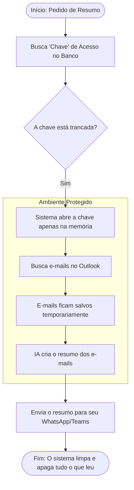

# Como funciona a Segurança e Privacidade

Este documento explica, de forma simples, como protegemos seus dados enquanto o sistema trabalha para você.

## 1. Fluxo de Trabalho (Como o sistema pensa)

## 2. Entendendo os termos de forma simples

### A 'Chave' Trancada (Criptografia)
Para ler seus e-mails, o sistema precisa de uma permissão (nossa "chave"). 
*   **O que fazemos:** Nós guardamos essa chave dentro de um cofre digital. Mesmo que alguém consiga entrar no nosso banco de dados, verá apenas um código bagunçado que não serve para nada. Só o nosso sistema tem o segredo para "desbagunçar" essa chave no momento do uso.

### Leitura Temporária (Sem Salvar nada)
Muitos sistemas guardam uma cópia das suas mensagens. O nosso funciona como um **quadro branco**:
1.  O sistema anota os e-mails no quadro.
2.  A inteligência artificial lê o quadro e faz o resumo.
3.  Assim que o resumo é enviado para você, o sistema **passa o apagador no quadro**.

**Resultado:** Não fica nenhum rastro dos seus e-mails ou dos resumos nos nossos servidores. O único lugar onde o resumo fica guardado é no seu próprio chat, onde só você tem acesso.

---

## 3. Garantias para você
*   **Privacidade:** Nenhum humano (nem os desenvolvedores) consegue ler seus e-mails.
*   **Segurança:** Suas permissões de acesso estão protegidas por criptografia de nível bancário (AES-256).
*   **Limpeza:** Terminada a tarefa, o sistema "esquece" tudo o que processou.
