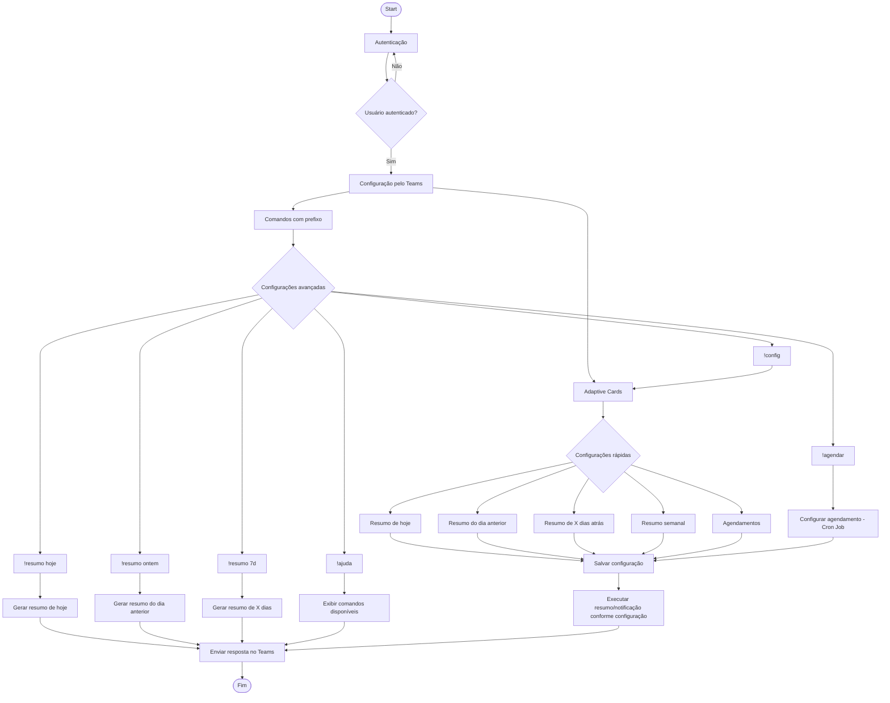

# Fluxo do Email Summarizer AI

Este documento descreve o fluxo inicial do protótipo de automação para leitura de e-mails, configuração via Microsoft Teams e envio de resumos/notificações.

```mermaid
flowchart TD
    A([Start]) --> B[Autenticação]
    B --> C{Usuário autenticado?}

    C -- Não --> B
    C -- Sim --> D[Configuração pelo Teams]

    D --> E[Adaptive Cards]
    D --> F[Comandos com prefixo]

    E --> G{Configurações rápidas}

    G --> G1[Resumo de hoje]
    G --> G2[Resumo do dia anterior]
    G --> G3[Resumo de X dias atrás]
    G --> G4[Resumo semanal]
    G --> G5[Agendamentos]

    G1 --> H[Salvar configuração]
    G2 --> H
    G3 --> H
    G4 --> H
    G5 --> H

    H --> I[Executar resumo/notificação conforme configuração]

    F --> J{Configurações avançadas}

    J --> J1[!ajuda]
    J --> J2[!config]
    J --> J3[!resumo hoje]
    J --> J4[!resumo ontem]
    J --> J5[!resumo 7d]
    J --> J6[!agendar]

    J1 --> K[Exibir comandos disponíveis]
    J2 --> E
    J3 --> L[Gerar resumo de hoje]
    J4 --> M[Gerar resumo do dia anterior]
    J5 --> N[Gerar resumo de X dias]
    J6 --> O[Configurar agendamento - Cron Job]

    L --> P[Enviar resposta no Teams]
    M --> P
    N --> P
    O --> H
    K --> P
    I --> P

    P --> Q([Fim])
```
